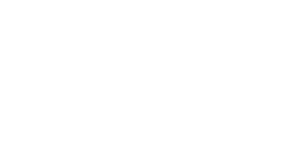

  

  <h3>
    Features of Prophetic Eye
  </h3>

#

You can see the deploy [here](https://prophetic-eye.vercel.app/)

# Features

  

- The client information feature allows saving the client's name, project requirements, and a description of their project.

#

  

- Once pulse _Get recommendation button_ the user will get the best member partner recommendation

#

  

- Team member can also create an experience about his projects and write about himself as professional

#

  

- User get experience Units about his work in the project he detailed 

#

  

- In team members section there is an overview of all team members ordered by his abilities